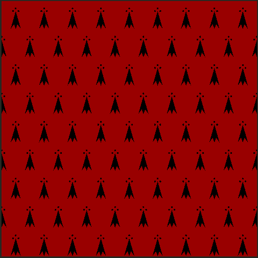
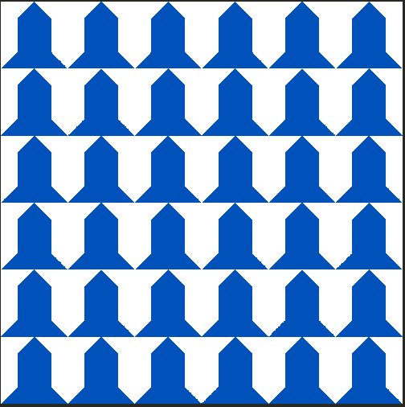
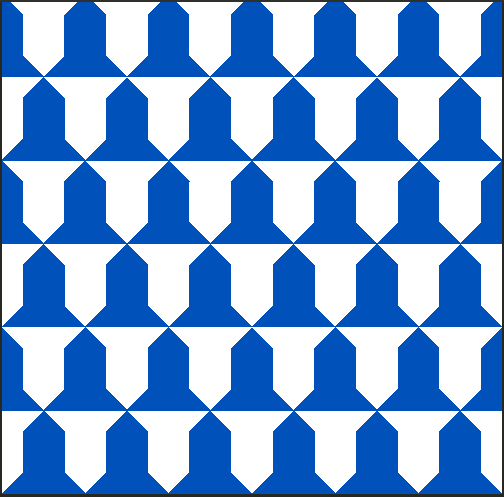
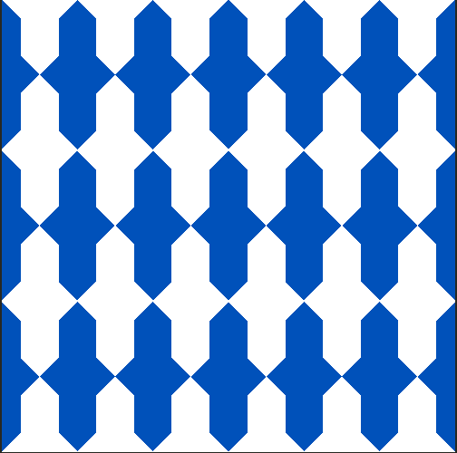
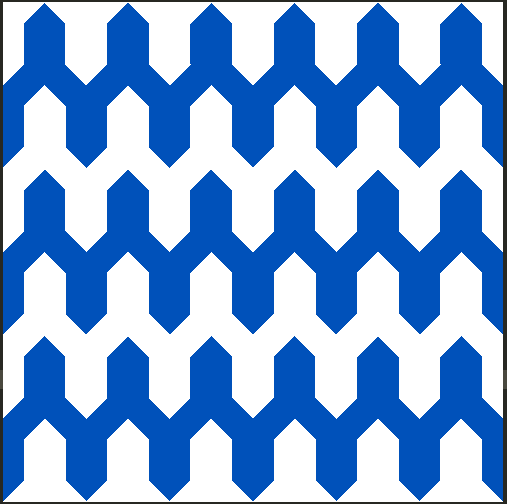

# Semana 9: Shaders
## Descripción del proyecto
En este proyecto recrea algunos de los forros (patrones) heráldicos más comunes mediante shaders GLSL procedimentales. Mi motivación ha sido mi interés personal por la heráldica, pues he visto en este proyecto la posibilidad de recrear algunos de sus elementos más característicos.

## Realización del código

### Armiño
El armiño (_ermine_) es un forro heráldico que representa la punta de la cola del animal homónimo. Para realizar este forro se crean varias "motas de armiño" que luego son repetidas mediante ```fract(st * scale)```. Cada mota consta de:
- Tres círculos superiores dispuestos en formación triangular.
- Tres triángulos isósceles que forman la colilla de la mota: uno central de mayor altura (apuntando hacia arriba) y dos laterales de base más ancha y altura más reducida (apuntando hacia el triángulo central).

La función ```isosceles_triangle()``` permite controlar de forma independiente el ancho y la altura del triángulo, además de aplicar rotaciones mediante matrices 2D para orientarlo correctamente. El patrón se repite en rejilla, con filas alternas desplazadas ```(mod(row, 2.0) * 0.5)```, para crear el efecto tradicional.
Los colores utilizados para este forro han sido gules (rojo) para el fondo y sable (negro) para las motas.

<p align="center">
  
</p>

### Vero
El vero (_vair_) es un forro heráldico que representa pieles de ardilla o de marta estilizadas en forma de campanas. Cada campana consta de:
- Un triángulo rectángulo superior pequeño.
- Un cuadrado central que forma el cuerpo de la campana.
- Un triángulo rectángulo inferior más grande.

La función ```right_triangle()``` utiliza límites definidos mediante ```step()``` y aplica rotaciones con la matriz ```rotate2d()``` para orientar correctamente cada triángulo. La función ```square()``` define un cuadrado centrado usando límites simétricos.
Al igual que para el patrón anterior, se utiliza ```fract(st * scale)``` para crear una rejilla en la que cada celda es ocupada por una campana.
Los colores utilizados para los forros siguientes han sido plata (blanco) para el fondo y azur (azul) para las campanas.

#### Vero en palo
El vero en palo (_vair in pale_) es la versión más simple del patrón. En ella las campanas se repiten uniformemente en una rejilla sin desplazamientos, de forma que todas están perfectamente alineadas vertical y horizontalmente.

<p align="center">
  
</p>

#### Vero plano
El vero plano (_vair plane_) es el patrón más común de vero. Se puede recrear a partir del anterior desplazando filas alternadas en el eje x mediante ```s.x += mod(floor(s.y), 2.0) * 0.5```, al igual que se hizo para el armiño.

<p align="center">
  
</p>

#### Contravero
El contravero (_counter-vair_) se realiza de forma similar al vero plano, sólo que, en vez de desplazar filas alternadas, estas se invierten verticalmente: ```s.y = mod(floor(s.y), 2.0) > 0.0 ? -s.y : s.y```.

<p align="center">
  
</p>

#### Vero en punta
Finalmente, el vero en punta (_vair in pointe_) se realiza combinando las dos operaciones anteriores: a la vez que se desplaza una fila en x, se invierte en y (```if(mod(f,2.)>0.){s.y=-s.y;s.x+=.5;}```).

<p align="center">
  
</p>

## Bibliografía
La principal fuente bibliográfica para la realización de este proyecto ha sido la documentación proporcionada por el profesor de la asignatura. No obstante, también se ha hecho uso de inteligencia artificial como fuente de apoyo para facilitar la comprensión del lenguaje y para el desarrollo de algunas funcionalidades.

